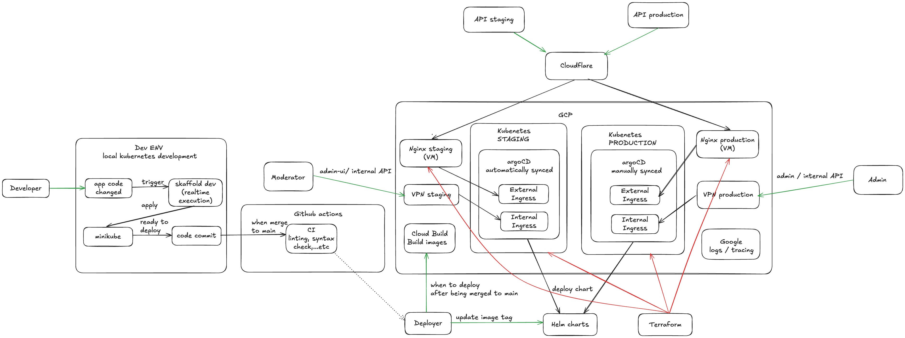

# Intended Design



### Development

Start a minikube cluster on your local machine 

Addon ingress into minikube

```
minikube addons enable ingress
```

```
skaffold dev
```

### Start the infrastructure

Move into terraform folder

```
cd terraform
```

```
terraform plan --out=tfplan \
  -target=module.cloudbuild \
  -target=module.postgres \
  -target=module.vpn \
  -target=module.vpc \
  -target=module.gke && terraform apply "tfplan"
```

Get GKE cluster credentials

```
gcloud container clusters get-credentials {{CLUSTER_NAME}} --region {{REGION}} --project {{GCP_ID}}
```

```
terraform plan --out=tfplan -target=module.k8s-services.helm_release.argocd && terraform apply "tfplan"
```

```
terraform plan --out=tfplan -target=module.k8s-services -target=module.nginx -target=module.dns && terraform apply "tfplan"
  ```

### VPN

Get the VPN server IP

```
terraform output vpn_server_ip
```

Get the VPN admin password

```
scp -i {open_vpn_private_key_path} {vpn_user}@{vpn_server_ip}:~/init.log ./
```

Get the opvn file

```
scp -i {open_vpn_private_key_path} {vpn_user}@{vpn_server_ip}:~/user.ovpn ./
```

### Postgres

Make sure you VPNed first

Get the Postgres connection Url

```
terraform output -raw postgres_connection_url
```